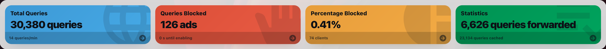

# Pi-hole Slim Card

A Lovelace custom card inspired by the classic Pi-hole dashboard tiles. The more popular full featured Pi-hole card was way too big for what I wanted, so I carefully created this with GPT 5.4 Codex.



## Features

- Four fixed Pi-hole style widgets:
  - Total Queries
  - Queries Blocked
  - Percentage Blocked
  - Domains on Lists
- Responsive layout with automatic reflow and single-column stacking on narrow screens
- Native Home Assistant more-info support
  - Main tile tap opens the main entity
  - Footer tap opens the sub entity when configured, otherwise the main entity
- Per-tile long-press navigation with Pi-hole-aware defaults
  - Each tile can open its own URL on hold
  - Relative tile URLs are resolved from the configured Pi-hole URL
  - When a tile URL is blank, holding falls back to the main Pi-hole URL
- Optional footer sub-entity state display
- Unit overrides for both the main value and footer value
- Built-in visual editor
- Optional long-press action that opens your Pi-hole URL
- Optional status switch entity that dims the card when it is `off` or `unavailable`

## Installation
You can install via HACS:

[](https://my.home-assistant.io/redirect/hacs_repository/?owner=inventor7777&repository=pi-hole-slim-card&category=plugin)

Or manually add the card as a Lovelace resource:

- URL: `/path/to/pi-hole-slim-card.js`
- Type: `module`

## Editor Options

Each widget can be configured with:

- Source entity
- Unit override
- Sub entity
- Sub unit override
- Label override
- Icon override
- Tile URL override

Card-wide options:

- Title
- Tile height
- Sub entity size
- Pi-hole URL used as the base for tile URLs and long press
- Status switch entity

## Example

```yaml
type: custom:pi-hole-slim-card
title: Pi-hole
pi_hole_url: http://pi.hole/admin
status_switch: switch.pi_hole_status
size: large
sub_entity_size: medium
sections:
  - key: total_queries
    entity: sensor.pihole_dns_queries_today
    unit: queries
    sub_entity: sensor.pihole_dns_queries_last_24h
    url: /queries
  - key: blocked_queries
    entity: sensor.pihole_ads_blocked_today
    unit: ads
    url: /queries?upstream=blocklist
  - key: percentage_blocked
    entity: sensor.pihole_ads_percentage_blocked_today
    url: /queries?upstream=blocklist
  - key: total_domains
    entity: sensor.pihole_domains_blocked
    unit: domains
    url: /groups-domains
```

With `pi_hole_url: http://192.168.50.2:1080/admin`, a tile URL like `/queries?upstream=blocklist` automatically opens `http://192.168.50.2:1080/admin/queries?upstream=blocklist`.

*Full disclaimer: This was fully vibe coded by GPT 5.4 Codex. However, I personally use this card and I am happy with it, so I decided to post in case it could help anyone else.*
